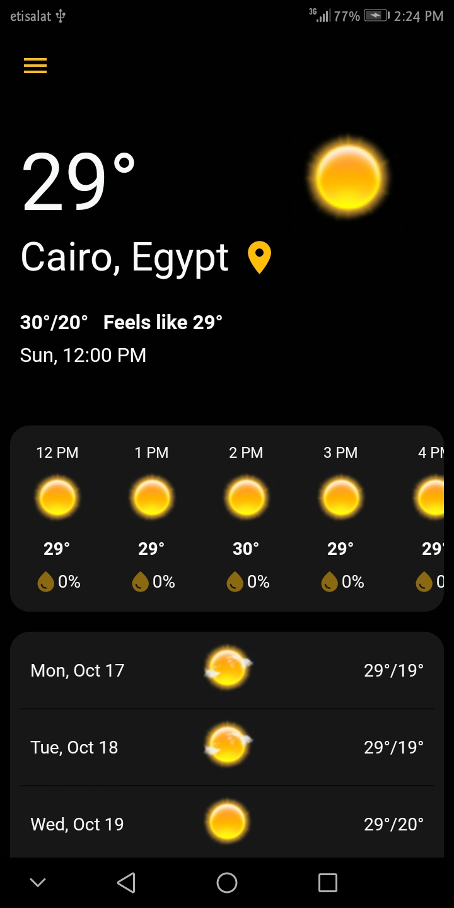
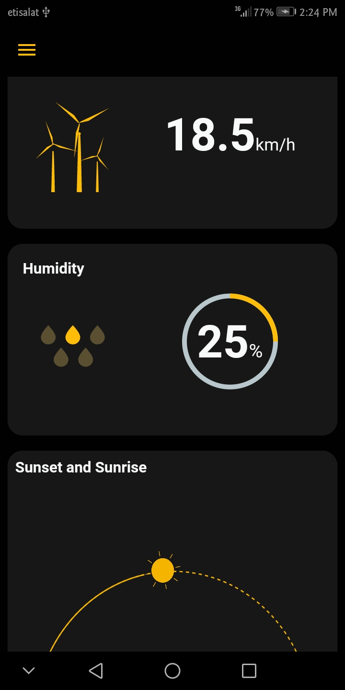
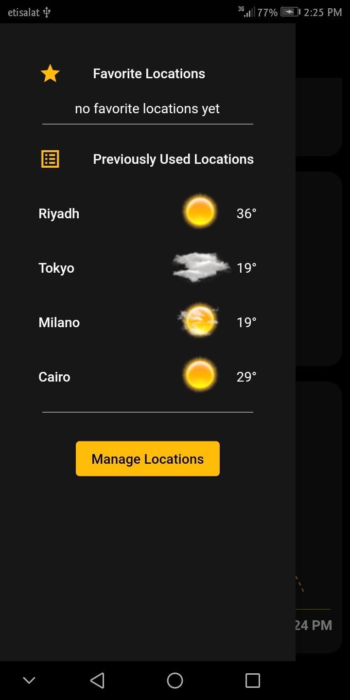
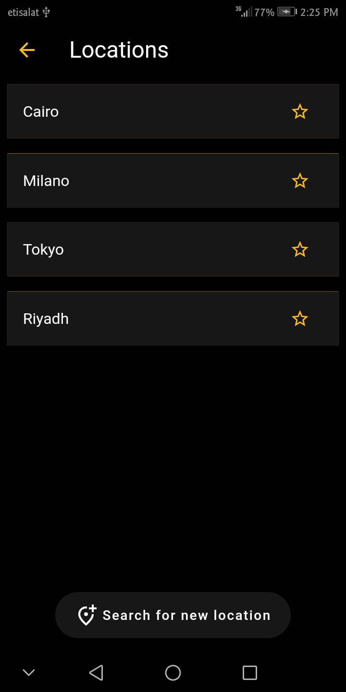

# Weather App :sunny:
# Description :pencil2:
 Weather App with Bloc and Clean Architecture:
 - search any location to get its latest forecast informations (current weather, next 12 hours, next 4 days)
 - saves all locations you searched before with its data localy
 - you can manage locations (delete, set favorite)
 - pull to refresh current location forecast
 - showing extra info (rain propabilty, wind speed, humidity, and sunrise/sunset times)  
 - using bloc for state management
 - powered by Accuweather API
 - implemented with the clean architicture Principle https://blog.cleancoder.com/uncle-bob/2012/08/13/the-clean-architecture.html
 - using S.O.L.I.D. Principles and Dependency injection for maintainability https://en.wikipedia.org/wiki/SOLID
 
 
  &nbsp;
  &nbsp;
  &nbsp;
  &nbsp;
